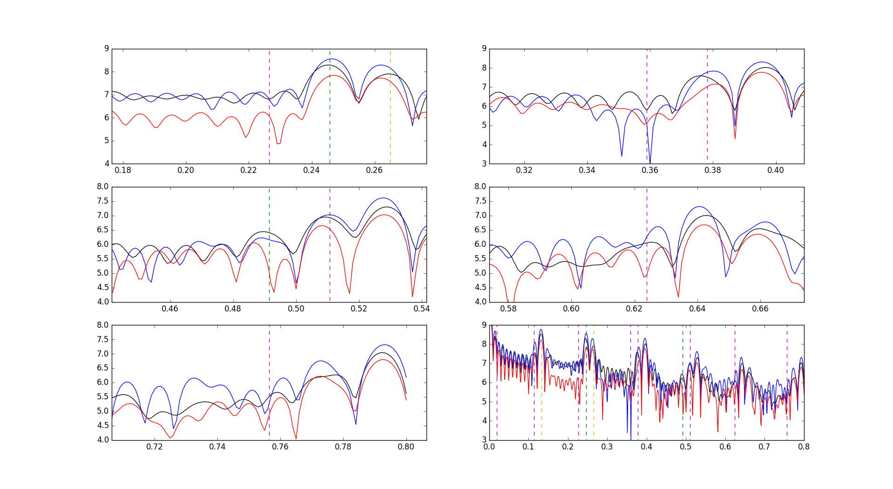
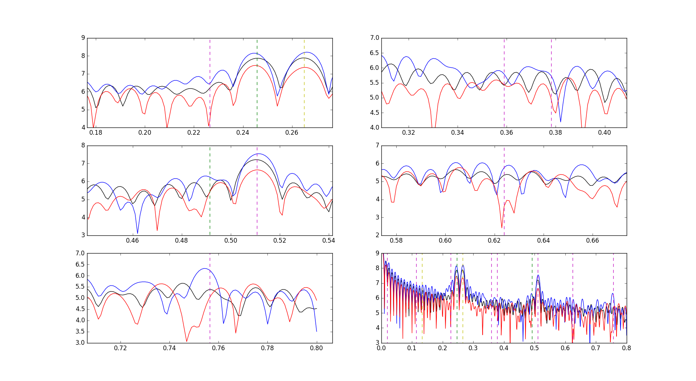
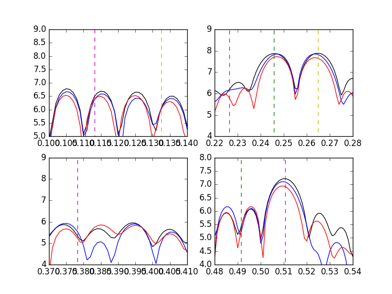
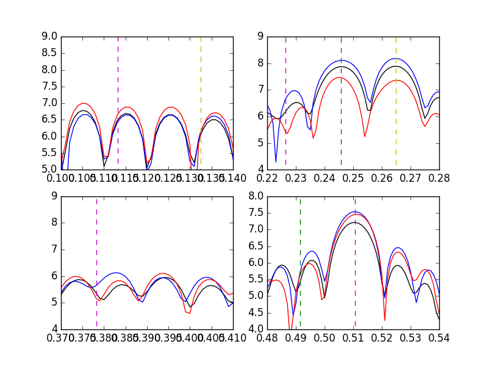
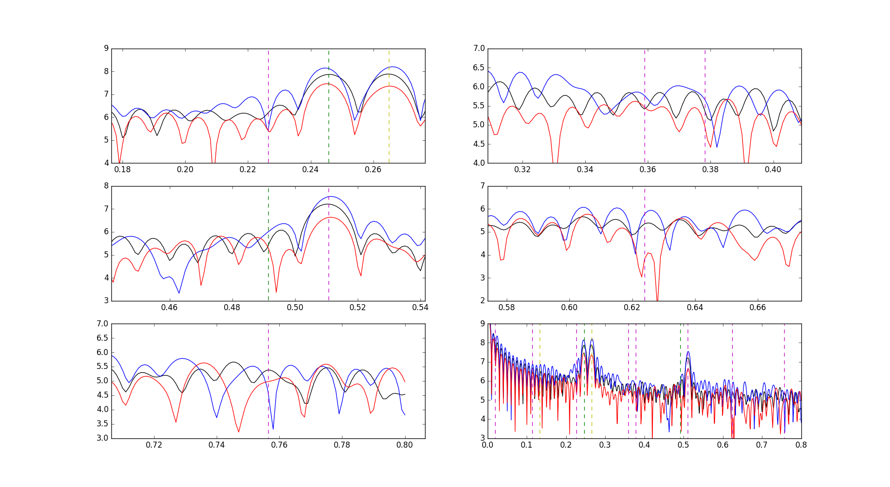

# 1806-20_polarization

Files involving polarization for SGR 1806-20 hyperflare.

All files are commented with descriptions for each block of lines.

----------------------------------------------------------------------------------------------------------------

fftfitrhessi.py: FT the RHESSI data by hand and solving for positions and differences of maxima in different detectors
Input - RHESSI.dat
Output - fftfitpars.dat, fftfitdifpars.dat (not included in github, not incredibly useful)

fftfitsample.py: FT the hand-generated data by hand and solving for positions and differences of maxima in different detectors
Input - tsample___.dat
Output - fftfitsamplepars.dat, fftfitsampledifpars.dat (not included in github, not incredibly useful)

fftrhessi.py: FT the RHESSI data by hand and create plots out of it
Input - RHESSI.dat
Output - fft_power_peaks_rhessi_5.png (not saved automatically), other plots

fftsample.py: FT the hand-generated data by hand and create plots out of it
Input - tsample___.dat
Output - fft_power_peaks_sample####.png (none saved automatically), other plots

rhessi_2pol.py: Calculates parameters for fits for data phased on other time intervals
Input - RHESSI.dat
Output - all other fitpars___.dat files

rhessi_polkui.py: Getting the parameters for the data phased on the satellite rotation period
Input - RHESSI.dat
Output - fitparsfsat.dat

sample_rhessi2.py: Generate sample data based on fits to the detectors
Input - RHESSI.dat, fitparsfsat.dat, fitpars2fsat.dat
Output - tsample___.dat

----------------------------------------------------------------------------------------------------------------

All the fitpars____.dat files have the parameters for the cosine fits to the data phased on different frequencies.  The first column has the amplitude of the cosine, second column has the phase, third colmn has the noise offset.  These have all 18 front and middle detectors.

RHESSI.dat has the photon data from the satelite.

----------------------------------------------------------------------------------------------------------------

For all of the plots the lines appear on the frequencies we're interested in (only go to second harmonics).  Lines are colour coded - green is a satellite-only harmonic, yellow is star-only harmonic, magenta is a combination

fft_power_peaks_rhessi_5.png: Fourier spectrum of the RHESSI data for the average of the detectors away from the scatterer (black), detector 8 (blue), and detector 9 (red).  Regions around harmonics containing 2fsat are shown.

fft_power_peaks_sample2_89.png: Fourier spectrum of the hand-generated data for the average of the detectors away from the scatterer (black), detector 8 (blue), and detector 9 (red).  Regions around harmonics containing 2fsat are shown.  This sample data had a polarized 8/9 detector at a different phase from fft_power_peaks_sample_89.png.

fft_power_peaks_sample_35.png: Fourier spectrum of the hand-generated data for the average of the detectors away from the scatterer (black), detector 3 (blue), and detector 5 (red).  Regions around large peaks are shown.

fft_power_peaks_sample_46.png: Fourier spectrum of the hand-generated data for the average of the detectors away from the scatterer (black), detector 4 (blue), and detector 6 (red).  Regions around large peaks are shown.

fft_power_peaks_sample_89.png: Fourier spectrum of the hand-generated data for the average of the detectors away from the scatterer (black), detector 8 (blue), and detector 9 (red).  Regions around harmonics containing 2fsat are shown.  This sample data had a polarized 8/9 detector at a different phase from fft_power_peaks_sample2_89.png.

